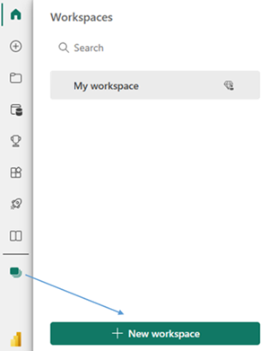
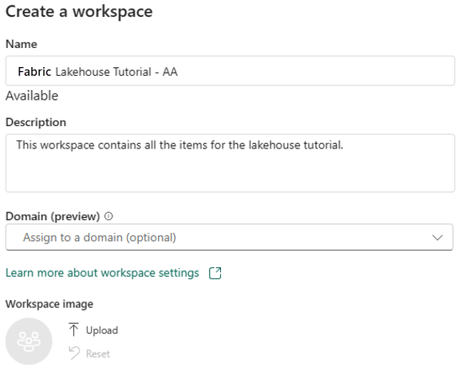
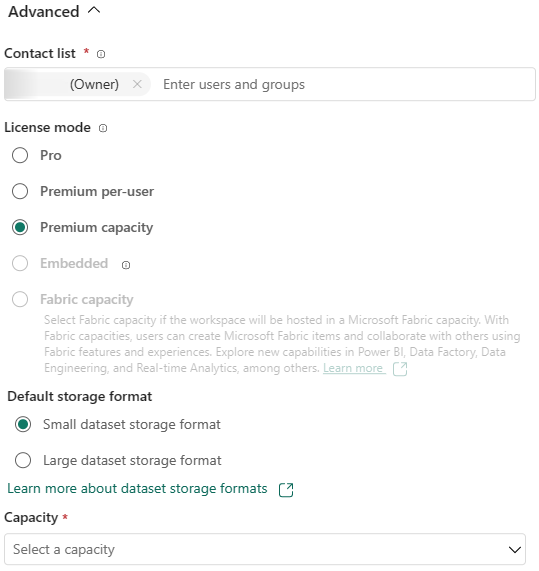
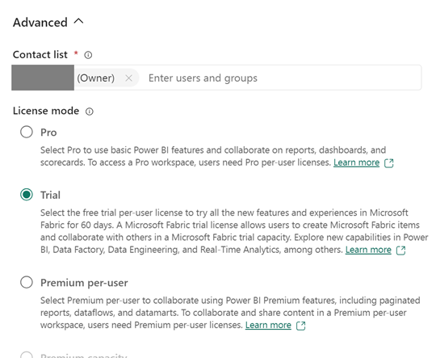

[**Back to the Readme section**](/FromZeroToHero_Parma/Readme.md)

# Create a workspace

In this step, you create a Fabric workspace. The workspace contains all the items needed for this lakehouse tutorial, which includes lakehouse, dataflows, Data Factory pipelines, the notebooks, Power BI datasets, and reports.

1. Sign in to [Power BI](https://powerbi.com/)
   
2. Select **Workspaces** and **New workspace**   
      .

3. Fill out the Create a workspace form with the following details:
    1. Name: Enter *Fabric Lakehouse Tutorial*, and any extra characters to make the name unique.
   
    1. Description: Enter an optional description for your workspace.   
      
   
    1. **Advanced:** Under License mode, select Premium or Trial capacity and then choose a premium capacity that you have access to.

        Premium capacity:

        

        Trial capacity:
        
        
   
4. Select **Apply** to create and open the workspace

[**Go to the next step**](/FromZeroToHero_Parma/Analytics%20-%20How%20To%20Proceed/2_Create_the_Bronze_Lakehouse.md)
