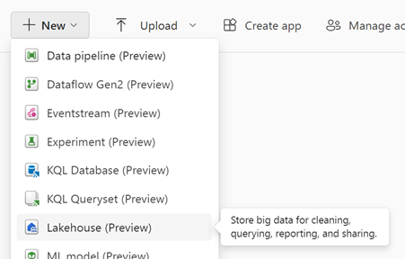

[**Back to the previous step**](/FromZeroToHero_Parma/Analytics%20-%20How%20To%20Proceed/1_Create_MS_Fabric_workspace.md)

# Create the Medallion architecture

[What is the medallion architecture:](https://learn.microsoft.com/en-us/azure/databricks/lakehouse/medallion)

The **bronze layer** contains unvalidated data. Data ingested in the bronze layer typically:

- Maintains the raw state of the data source.
- Is appended incrementally and grows over time.
- Can be any combination of streaming and batch transactions.

The **silver layer** represents a validated, enriched version of our data that can be trusted for downstream analytics.

This **gold layer** is often highly refined and aggregated, containing data that powers analytics, machine learning, and production applications.

## Create the Bronze layer with a lakehouse

1. Select the Data Engineering experience.

    

2. From the previously created Workspace, select New>Lakehouse to create a lakehouse.

    

3. In the New lakehouse dialog box, enter **Bronze** in the Name field.
4. Select **Create** to create and open the new lakehouse.

## Ingest Sample data

Now you will learn how to import data from Csv files using a Dataflow Gen2 in Microsoft Fabric.

1. Download the *dimension_customer.csv* file from the [Fabric samples repo](https://github.com/microsoft/fabric-samples/blob/689e78676174d4627fc3855165bde9100cb4d19e/docs-samples/data-engineering/dimension_customer.csv).
2. In the **Lakehouse explorer**, you see options to load data into lakehouse. Select New Dataflow Gen2.

    

3. On the new dataflow pane, select Import from a Text/CSV file.

    

4. On the Connect to data source pane, select the Upload file radio button. Drag and drop the dimension_customer.csv file that you downloaded in step 1. After the file is uploaded, select Next.

    

5. From the **Preview file data** page, preview the data and select Create to proceed and return back to the dataflow canvas.
6. From the dataflow canvas, you can easily transform the data based on your business requirements. For simplicity, we aren't making any changes in this tutorial. To proceed, select **Publish** at the bottom right of the screen.</br>  

    

7. A spinning circle next to the dataflow's name indicates publishing is in progress in the item view. When publishing is complete, select the ... and select **Properties**. Rename the dataflow to *Load Lakehouse Table* and select Save.
8. Once the dataflow is refreshed, select your new lakehouse in the left navigation panel to view the **dimension_customer** delta table. Select the table to preview its data. You can also use the SQL endpoint of the lakehouse to query the data with SQL statements. Select **SQL analytics endpoint** from the **Lakehouse** drop-down menu at the top right of the screen.

    

9. Select the dimension_customer table to preview its data or select New SQL query to write your SQL statements.</br>  

    

10. Using the Default SQL endpoint you can run T-SQL code to explore the data. The following sample query aggregates the row count based on the *BuyingGroup* column of the *dimension_customer* table. SQL query files are saved automatically for future reference, and you can rename or delete these files based on your need. To run the script, select the Run icon at the top of the script file.
  
    ``` sql
    SELECT BuyingGroup, Count(*) AS Total
    FROM dimension_customer
    GROUP BY BuyingGroup
    ```

    

[**Go to the next step**](/FromZeroToHero_Parma/Analytics%20-%20How%20To%20Proceed/3_Explore_the_Default_Dataset.md)
