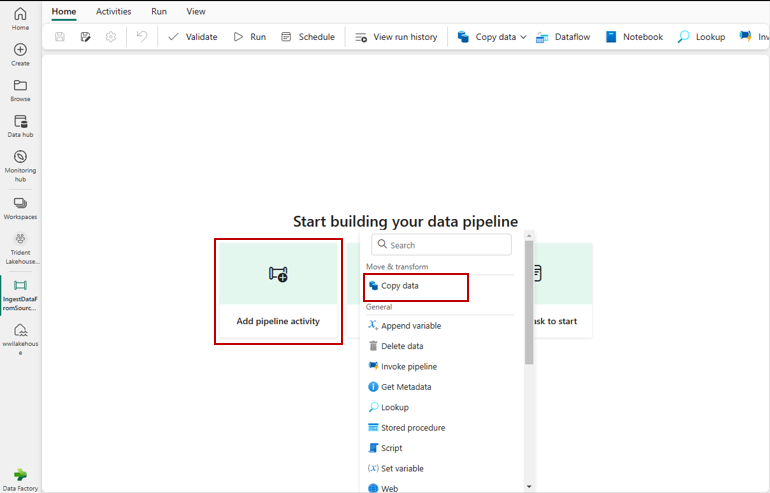
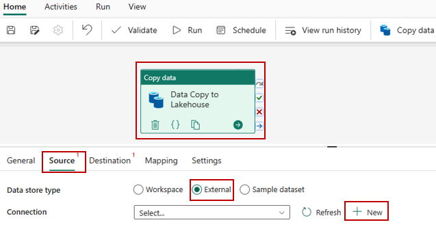
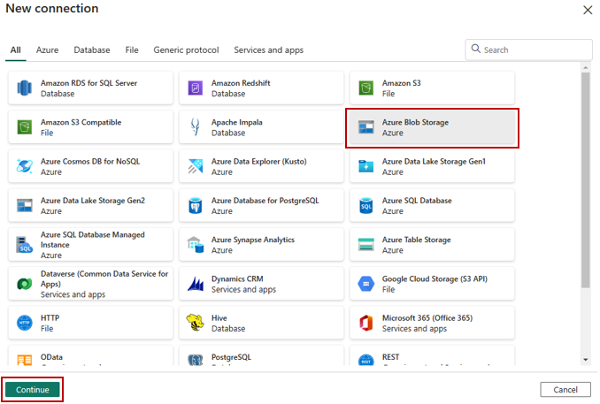
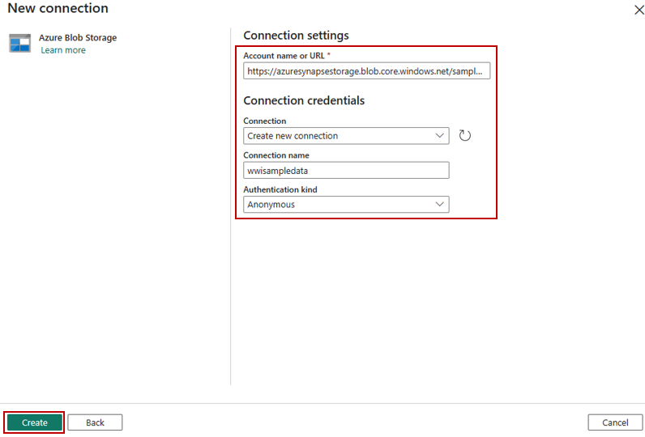
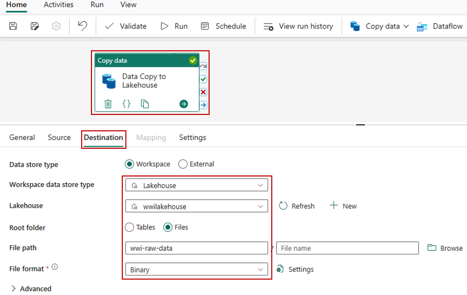
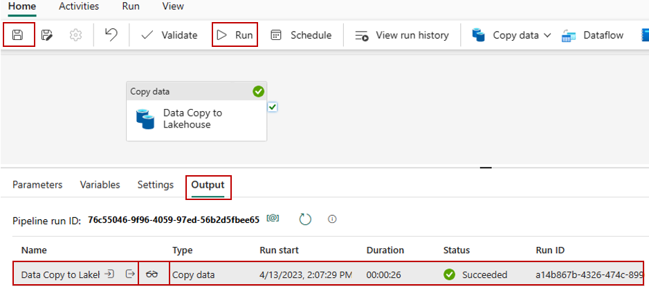
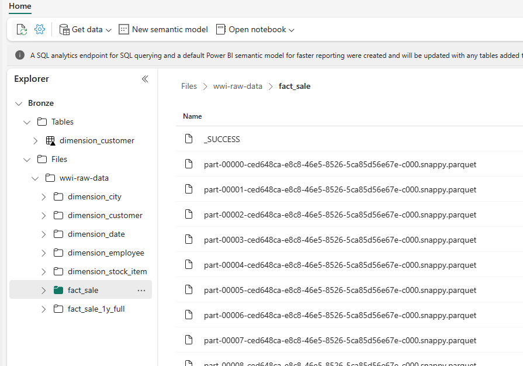

[**Back to the previous step**](/FromZeroToHero_Parma/Analytics%20-%20How%20To%20Proceed/3_Explore_the_Default_Dataset.md)

# Ingest data

In this section, you use the **Copy data activity** of the **Data Factory pipeline** to ingest sample data from an **Azure storage account** to the **Files** section of the **Bronze** lakehouse you created earlier.

1. Select Workspaces in the left navigation pane, and then select your new workspace from the Workspaces menu. The items view of your workspace appears.   
   

2. From the **+New** button in the workspace page, select **Data pipeline**.

3. In the **New pipeline** dialog box, specify the name as **IngestDataFromSourceToLakehous**e and select **Create**. A new data factory pipeline is created and opened.

4. On your newly created data factory pipeline, select **Add pipeline activity** to add an activity to the pipeline and select **Copy data**. This action adds copy data activity to the pipeline canvas.   
    

5. Select the newly added copy data activity from the canvas. Activity properties appear in a pane below the canvas (you may need to expand the pane upwards by dragging the top edge). Under the **General** tab in the properties pane, specify the name for the copy data activity **Data Copy to Lakehouse**.   
    

6. Under Source tab of the selected copy data activity, select **External** as **Data store type** and then select **+ New** to create a new connection to data source.   
    

7. For this tutorial, all the sample data is available in this public container of Azure blob storage: `*https://azuresynapsestorage.blob.core.windows.net/sampledata*`. You connect to this container to copy data from it. On the **New connection** wizard, select **Azure Blob Storage** and then select **Continue**.   
    

8. On the next screen of the **New connection** wizard, enter the following details and select **Create** to create the connection to the data source.

    | Propery         | Value     |
    |--------------|-----------|
    | Account name or URI | `https://azuresynapsestorage.blob.core.windows.net/sampledata`      |
    | Connection      | Create new connection  |
    | Connection name      | wwisampledata  |
    | Authentication kind      | Anonymous  |

    

9. Once the new connection is created, return to the **Source** tab of the copy data activity, and the newly created connection is selected by default. Specify the following properties before moving to the destination settings.

    |Property | Value |
    |--------------|-----------|
    |Data store type    | External|
    |Connection |   wwisampledata |
    |File path type | File path |
    |File path | Container name (first text box): sampledata; Directory name (second text box): WideWorldImportersDW/parquet/full |
    |Recursively    | Checked |
    |File Format    | Binary |

    

10. Under the **Destination** tab of the selected copy data activity, specify the following properties:

    |Property| Value |
    |--------------|-----------|
    |Data store type    | Workspace |
    |Workspace data store type  | Lakehouse |
    |Lakehouse  | Bronze |
    |Root Folder    | Files |
    |File path  | Directory name (first text box): wwi-raw-data|
    |File Format    | Binary |

    

11. Select the **Save** button on the top ribbon (under **Home**) to save your changes, and select **Run** to execute your pipeline and its activity. You can also schedule pipelines to refresh data at defined intervals to meet your business requirements. For this tutorial, we run the pipeline only once by clicking on **Run** button. It can take few minutes to complete.

12. You can monitor the execution of the pipeline and its activity under the Output tab, which appears when you click anywhere on the canvas. Optionally, you can select the glasses icon, which appears when you hover over the name, to look at the details of the data transfer.

    

13. Once the data is copied, go to the items view of the workspace and select your new lakehouse (Bronze) to launch the **Lakehouse explorer**.

    

[**Go to the next step**](/FromZeroToHero_Parma/Analytics%20-%20How%20To%20Proceed/5_Prepare_Delta_Tables.md)

