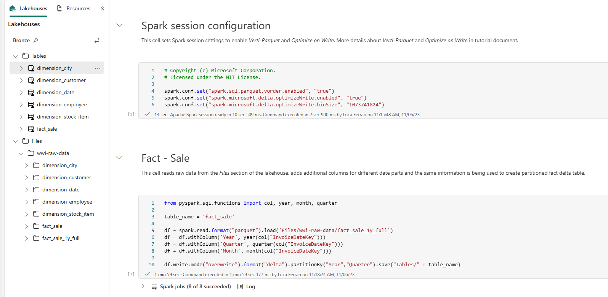

[**Back to the previous step**](/FromZeroToHero_Parma/Analytics%20-%20How%20To%20Proceed/4_Ingest_Data_Using_Pipeline.md)

# Prepare Delta tables

From the previous tutorial steps, we have raw data ingested from the source to the Files section of the lakehouse. Now you can transform that data and prepare it for creating delta tables.

1. Download the notebooks from the [Lakehouse Tutorial Source Code](/FromZeroToHero_Parma/Notebooks/) folder.

2. Select **Import notebook** from the **+New** section at the top of the landing page.

   

3. Select **Upload** from the Import status pane that opens on the right side of the screen.

4. Select all the notebooks that were downloaded in the step 1 of this section.

   

5. Select **Open**. A notification indicating the status of the import appears in the top right corner of the browser window.

6. After the import is successful, you can go to items view of the workspace and see the newly imported notebooks. Select **Bronze**** lakehouse to open it.

   

7. From the list of existing notebooks, select the **01 - Create Delta Tables** notebook and select **Open**.

8. In the open notebook in **Lakehouse explorer**, you see the notebook is already linked to your opened lakehouse.

9. Before you write data as delta lake tables in the **Tables** section of the lakehouse, you use two Fabric features ([**V-order**](https://learn.microsoft.com/en-us/fabric/data-engineering/delta-optimization-and-v-order?tabs=sparksql) and [**Optimize Write**](https://learn.microsoft.com/en-us/fabric/data-engineering/delta-optimization-and-v-order#what-is-optimized-write)) for optimized data writing and for improved reading performance. To enable these features in your session, set these configurations in the first cell of your notebook.

10. To start the notebook and execute all the cells in sequence, select Run All on the top ribbon (under Home). Or, to only execute code from a specific cell, select the **Run** icon that appears to the left of the cell upon hover, or press **SHIFT + ENTER** on your keyboard while control is in the cell.

   

    When running a cell, you didn't have to specify the underlying Spark pool or cluster details because Fabric provides them through Live Pool. Every Fabric workspace comes with a default Spark pool, called Live Pool. This means when you create notebooks, you don't have to worry about specifying any Spark configurations or cluster details. When you execute the first notebook command, the live pool is up and running in a few seconds. And the Spark session is established and it starts executing the code. Subsequent code execution is almost instantaneous in this notebook while the Spark session is active.

11. Next, you read raw data from the **Files** section of the lakehouse, and add more columns for different date parts as part of the transformation. Finally, you use partitionBy Spark API to partition the data before writing it as delta table based on the newly created data part columns (*Year and Quarter*).

    ```python
    from pyspark.sql.functions import col, year, month, quarter

    table_name = 'fact_sale'

    df = spark.read.format("parquet").load('Files/wwi-raw-data/full/fact_sale_1y_full')
    df = df.withColumn('Year', year(col("InvoiceDateKey")))
    df = df.withColumn('Quarter', quarter(col("InvoiceDateKey")))
    df = df.withColumn('Month', month(col("InvoiceDateKey")))

    df.write.mode("overwrite").format("delta").partitionBy("Year","Quarter").save("Tables/" + table_name)
    ```

12. After the fact tables load, you can move on to loading data for the rest of the dimensions. The following cell creates a function to read raw data from the **Files** section of the lakehouse for each of the table names passed as a parameter. Next, it creates a list of dimension tables. Finally, it loops through the list of tables and creates a delta table for each table name that's read from the input parameter. Note that the script will drop the column named **Photo** in this example since the column is not used.

    ```python
    from pyspark.sql.types import *
    def loadFullDataFromSource(table_name):
        df = spark.read.format("parquet").load('Files/wwi-raw-data/' + table_name)
        df = df.drop("Photo")
        df.write.mode("overwrite").format("delta").save("Tables/" + table_name)

    full_tables = [
        'dimension_city',
        'dimension_date',
        'dimension_employee',
        'dimension_stock_item'
        ]

    for table in full_tables:
        loadFullDataFromSource(table)
    ```

    This can take few minutes to complete.

13. To validate the created tables, right click and select refresh on the **Bronze** lakehouse. The tables appear.

   

Delta Tables are now available and you can use them to populate the **Silver layer**.

[**Go to the next step**](/FromZeroToHero_Parma/Analytics%20-%20How%20To%20Proceed/6_Prepare_Silver_Layer.md)
