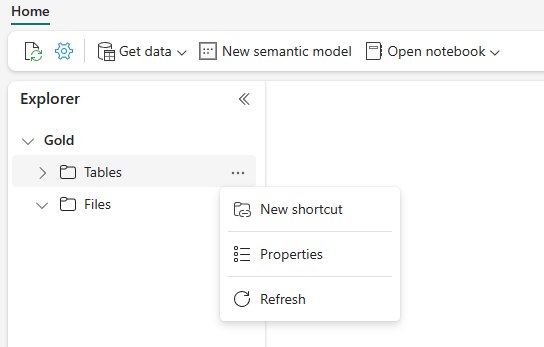
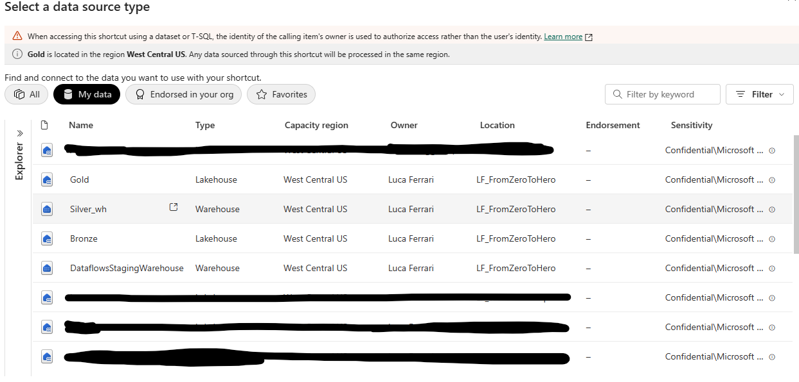
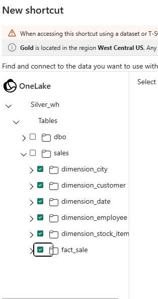
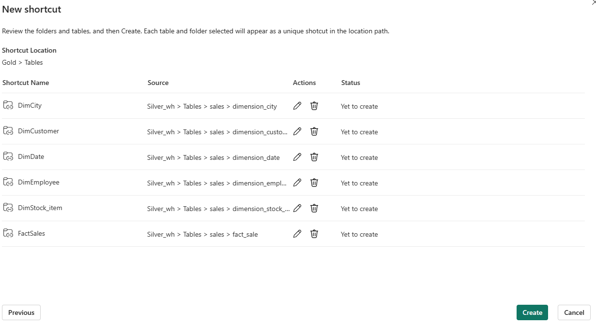
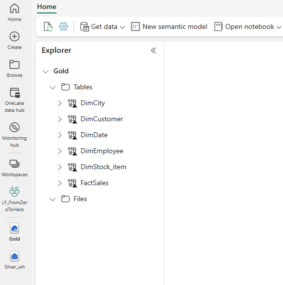
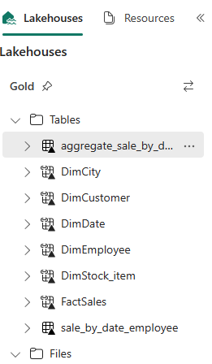

[**Back to the previous step**](/FromZeroToHero_Parma/Analytics%20-%20How%20To%20Proceed/6_Prepare_Silver_Layer.md)

This **gold layer** is often highly refined and aggregated, containing data that powers analytics, machine learning, and production applications.

## Create the Gold layer with a lakehouse
From the previously created Workspace, select Lakehouse to create a lakehouse
   
2. In the New lakehouse dialog box, enter **Gold** in the Name field.
   
3. Select **Create** to create and open the new lakehouse.

## Create Shortcuts 

[Shortcuts](https://learn.microsoft.com/en-us/fabric/onelake/onelake-shortcuts) are objects in OneLake that point to other storage locations. The location can be internal or external to OneLake. Shortcuts can be create for Folder and for Tables.

1. Go the items view of the workspace again and select the **Gold** lakehouse to open it.

2. Select the **Tables** section using the 3 dots, create a **New Shortcut** and choose **Microsoft OneLake**</br>  
   

3. Select the **Silver** warehouse and click on **Next**</br>  
   

4. Select all the tables and click on **Next**</br>  
   

5. Rename the shortcuts as per the image below and click **Create**</br>  
   

6. Validate the shortcuts, they appear in the **Tables** section and can be used in the **Notebooks** as well as in **SELECT commands** using the **Sql Endpoint**</br>  
   

7. In the lakehouse view, select Open notebook > Existing notebook from the ribbon and choose [02 - Data Transformation - Business Aggregates](/FromZeroToHero_Parma/Notebooks/02%20-%20Data%20Transformation%20-%20Business%20Aggregates.ipynb). 

8. An organization might have data engineers working with Scala/Python and other data engineers working with SQL (Spark SQL or T-SQL), all working on the same copy of the data. Fabric makes it possible for these different groups, with varied experience and preference, to work and collaborate. The two different approaches transform and generate business aggregates. You can pick the one suitable for you or mix and match these approaches based on your preference without compromising on the performance:

   1. Approach #1 - Use PySpark to join and aggregates data for generating business aggregates. This approach is preferable to someone with a programming (Python or PySpark) background.

   2. Approach #2 - Use Spark SQL to join and aggregates data for generating business aggregates. This approach is preferable to someone with SQL background, transitioning to Spark.

9. **Approach #1 (sale_by_date_city)** - Use PySpark to join and aggregate data for generating business aggregates. With the following code, you create three different Spark dataframes, each referencing an existing delta table. Then you join these tables using the dataframes, do group by to generate aggregation, rename a few of the columns, and finally write it as a delta table in the Tables section of the lakehouse to persist with the data.

In this cell, you create three different Spark dataframes, each referencing an existing delta table through a shortcut.

```python 
df_fact_sale = spark.read.table("Gold.FactSales") 
df_dimension_date = spark.read.table("Gold.DimDate")
df_dimension_city = spark.read.table("Gold.DimCity")
```

In this cell, you join these tables using the dataframes created earlier, do group by to generate aggregation, rename a few of the columns, and finally write it as a delta table in the Tables section of the lakehouse.

```python 
sale_by_date_city = df_fact_sale.alias("sale") \
.join(df_dimension_date.alias("date"), df_fact_sale.InvoiceDateKey == df_dimension_date.Date, "inner") \
.join(df_dimension_city.alias("city"), df_fact_sale.CityKey == df_dimension_city.CityKey, "inner") \
.select("date.Date", "date.CalendarMonthLabel", "date.Day", "date.ShortMonth", "date.CalendarYear", "city.City", "city.StateProvince", "city.SalesTerritory", "sale.TotalExcludingTax", "sale.TaxAmount", "sale.TotalIncludingTax", "sale.Profit")\
.groupBy("date.Date", "date.CalendarMonthLabel", "date.Day", "date.ShortMonth", "date.CalendarYear", "city.City", "city.StateProvince", "city.SalesTerritory")\
.sum("sale.TotalExcludingTax", "sale.TaxAmount", "sale.TotalIncludingTax", "sale.Profit")\
.withColumnRenamed("sum(TotalExcludingTax)", "SumOfTotalExcludingTax")\
.withColumnRenamed("sum(TaxAmount)", "SumOfTaxAmount")\
.withColumnRenamed("sum(TotalIncludingTax)", "SumOfTotalIncludingTax")\
.withColumnRenamed("sum(Profit)", "SumOfProfit")\
.orderBy("date.Date", "city.StateProvince", "city.City")

sale_by_date_city.write.mode("overwrite").format("delta").option("overwriteSchema", "true").save("Tables/aggregate_sale_by_date_city")
```

10. **Approach #2 (sale_by_date_employee)** - Use Spark SQL to join and aggregate data for generating business aggregates. With the following code, you create a brand new delta table by joining three tables, do group by to generate aggregation, and rename a few of the columns.

``` sql
CREATE OR REPLACE TABLE sale_by_date_employee
USING DELTA
AS
SELECT
	DD.Date, DD.CalendarMonthLabel
    , DD.Day, DD.ShortMonth Month, CalendarYear Year
	,DE.PreferredName, DE.Employee
	,SUM(FS.TotalExcludingTax) SumOfTotalExcludingTax
	,SUM(FS.TaxAmount) SumOfTaxAmount
	,SUM(FS.TotalIncludingTax) SumOfTotalIncludingTax
	,SUM(Profit) SumOfProfit 
FROM Gold.FactSales FS
INNER JOIN Gold.DimDate DD ON FS.InvoiceDateKey = DD.Date
INNER JOIN Gold.DimEmployee DE ON FS.SalespersonKey = DE.EmployeeKey
GROUP BY DD.Date, DD.CalendarMonthLabel, DD.Day, DD.ShortMonth, DD.CalendarYear, DE.PreferredName, DE.Employee
ORDER BY DD.Date ASC, DE.PreferredName ASC, DE.Employee ASC
```

11. To validate the created tables, right click and select refresh on the Gold lakehouse. The aggregate tables appear.</br>  
    


[**Go to the next step**](/FromZeroToHero_Parma/Analytics%20-%20How%20To%20Proceed/8_Build_the_reports.md)