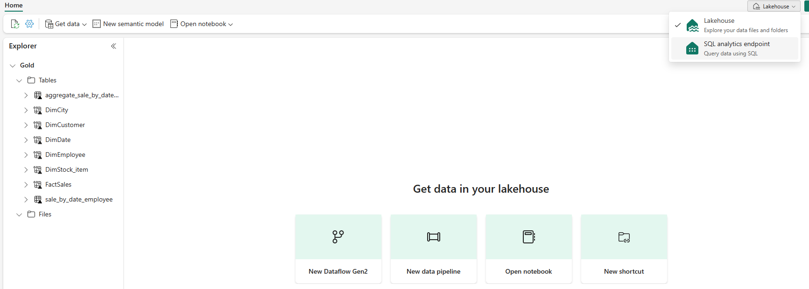
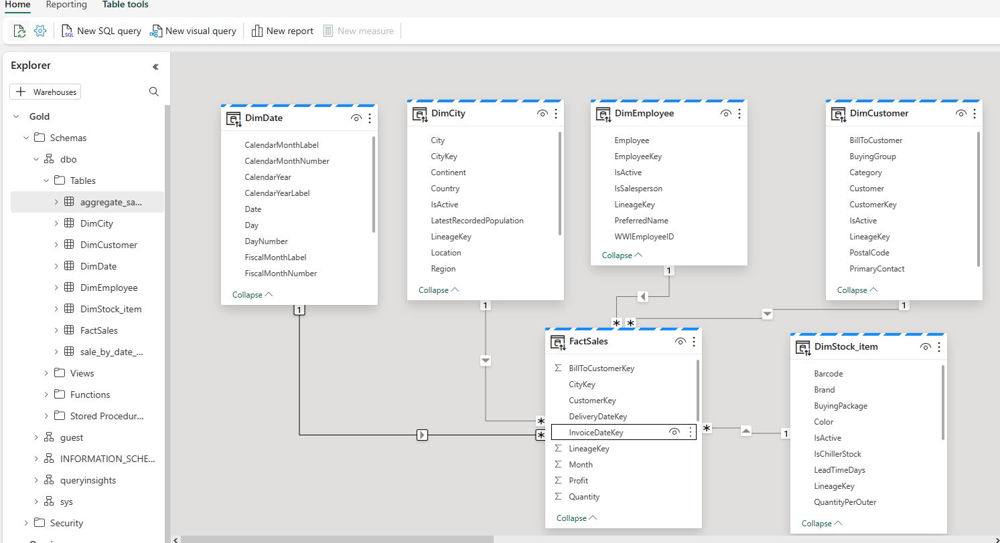
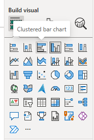
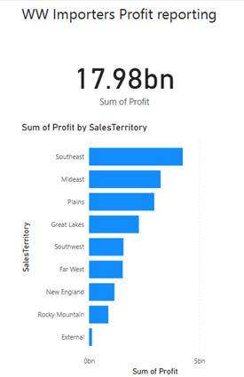
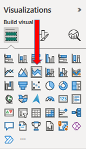
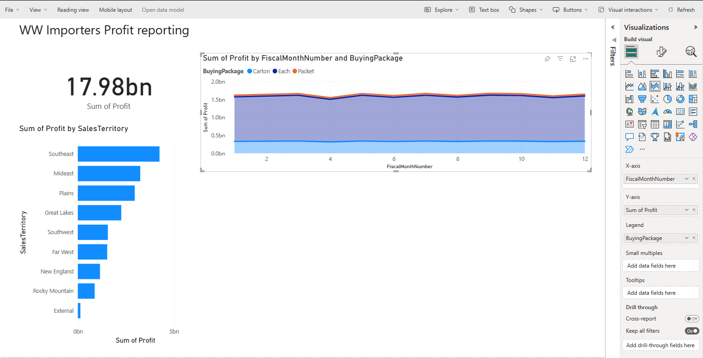
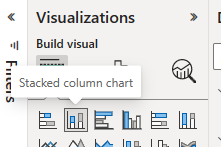
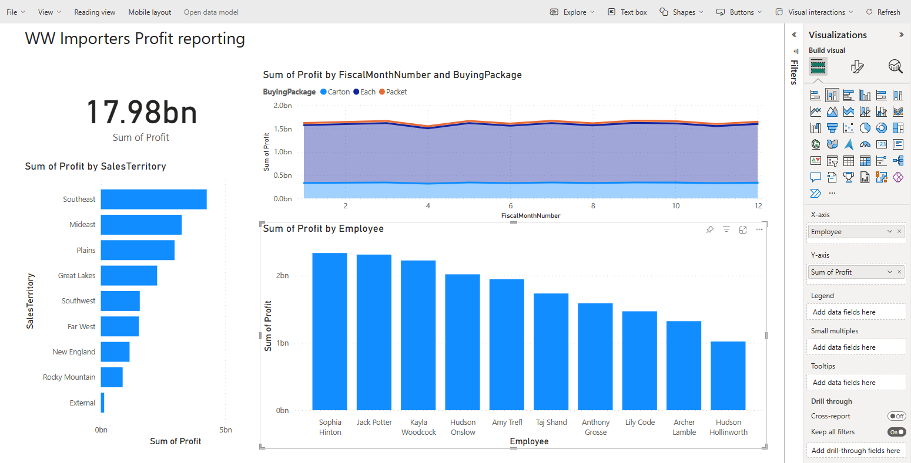

[**Back to the previous step**](/FromZeroToHero_Parma/Analytics%20-%20How%20To%20Proceed/7_Prepare_Gold_Layer.md)

Power BI is natively integrated in the whole Fabric experience. This native integration brings a unique mode, called [DirectLake](https://learn.microsoft.com/en-us/power-bi/enterprise/directlake-overview), of accessing the data from the lakehouse to provide the most performant query and reporting experience. DirectLake mode is a groundbreaking new engine capability to analyze very large datasets in Power BI. The technology is based on the idea of loading parquet-formatted files directly from a data lake without having to query a data warehouse or lakehouse endpoint, and without having to import or duplicate data into a Power BI dataset. DirectLake is a fast path to load the data from the data lake straight into the Power BI engine, ready for analysis.

In traditional DirectQuery mode, the Power BI engine directly queries the data from the source for each query execution, and the query performance depends on the data retrieval speed. DirectQuery eliminates the need to copy data, ensuring that any changes in the source are immediately reflected in query results. On the other hand, in the import mode, the performance is much better because the data is readily available in memory without having to query the data from the source for each query execution, however the Power BI engine must first copy the data into the memory at data refresh time. Any changes to the underlying data source are picked up during the next data refresh(in scheduled as well as on-demand refresh).

DirectLake mode now eliminates this import requirement by loading the data files directly into memory. Because there's no explicit import process, it's possible to pick up any changes at the source as they occur, thus combining the advantages of DirectQuery and import mode while avoiding their disadvantages. DirectLake mode is therefore the ideal choice for analyzing very large datasets and datasets with frequent updates at the source.

1. From your **Gold** lakehouse, select SQL endpoint from the Lakehouse drop-down menu at the top right of the screen.   
   

2. From the SQL endpoint pane, you should be able to see all the tables you created. If you don't see them yet, select the **Refresh** icon at the top. Next, select the **Model** tab at the bottom to open the default Power BI dataset.   
   

3. For this data model, you need to define the relationship between different tables so that you can create reports and visualizations based on data coming across different tables. From the **FactSales** table, drag the **CityKey** field and drop it on the **CityKey** field in the **DimCity** table to create a relationship. The Create Relationship dialog box appears.   

4. In the Create Relationship dialog box:

Table 1 is populated with FactSales and the column of CityKey.

Table 2 is populated with DimCity and the column of CityKey.

Cardinality: Many to one (*:1)

Cross filter direction: Single

Leave the box next to Make this relationship active selected.

Select the box next to Assume referential integrity.

Select **Ok**.   
   

5. Next, add these relationships with the same Create Relationship settings as shown above but with the following tables and columns:

StockItemKey(FactSales) - StockItemKey(DimStock_item)
Salespersonkey(FactSales) - EmployeeKey(DimEmployee)
CustomerKey(FactSales) - CustomerKey(DimCustomer)
InvoiceDateKey(FactSales) - Date(DimDate)

After you add these relationships, your data model is ready for reporting as shown in the following image:   
   

6. Select **New report** to start creating reports/dashboards in Power BI. On the Power BI report canvas, you can create reports to meet your business requirements by dragging required columns from the **Data** pane to the canvas and using one or more of available visualizations.   
   

7. Add a title:
   1. In the Ribbon, select **Text box**.
   2. Type in **WW Importers Profit Reporting**.
   3. Highlight the text and increase size to 20 and place in the upper left of the report page.

8. Add a Card
   1. On the Data pane, expand FactSales and check the box next to Profit. This selection creates a column chart and adds the field to the Y-axis.
   2. With the bar chart selected, select the Card visual in the visualization pane. This selection converts the visual to a card.
   3. Place the card under the title.   
      

9. Add a Bar chart:
   1.  On the Data pane, expand **FactSales** and check the box next to **Profit**. This selection creates a column chart and adds the field to the Y-axis.
   2.  On the Data pane, expand **DimCity** and check the box for **SalesTerritory**. This selection adds the field to the Y-axis.
   3.  With the bar chart selected, select the Clustered bar chart visual in the visualization pane. This selection converts the column chart into a bar chart.   
       
   4.  Resize the Bar chart to fill in the area under the title and Card   
       

10. Click anywhere on the blank canvas (or press the Esc key) so the bar chart is no longer selected.

11. Build a stacked area chart visual:
    1.  On the Visualizations pane, select the Stacked area chart visual.   
       
    2. Reposition and resize the stacked area chart to the right of the card and bar chart visuals created in the previous steps.
    3. On the **Data** pane, expand **FactSales** and check the box next to **Profit**. Expand **DimDate** and check the box next to **FiscalMonthNumber**. This selection creates a filled line chart showing profit by fiscal month.
    4. On the Data pane, expand **DimStock_item** and drag **BuyingPackage** into the Legend field well. This selection adds a line for each of the Buying Packages.   
       

12. Click anywhere on the blank canvas (or press the Esc key) so the stacked area chart is no longer selected.

13. Build a column chart:
    1. On the **Visualizations** pane, select the Stacked column chart visual.   
       
    2. On the Data pane, expand **FactSales** and check the box next to **Profit**. This selection adds the field to the Y-axis.
    3. On the Data pane, expand **DimEmployee** and check the box next to **Employee**. This selection adds the field to the X-axis.   
       

14. Click anywhere on the blank canvas (or press the Esc key) so the chart is no longer selected.

15. From the ribbon, select **File > Save**.

16. Enter the name of your report as **Profit Reporting**.

17. Select **Save**.