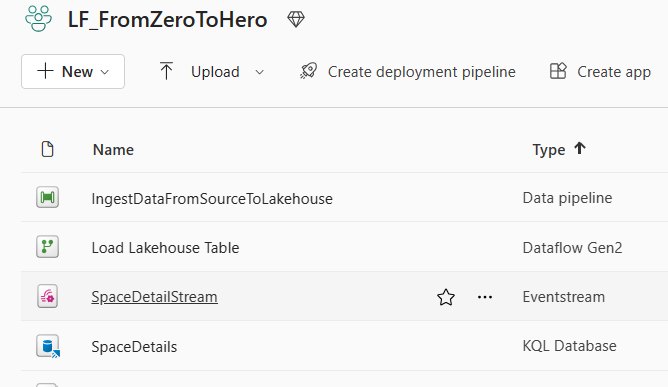
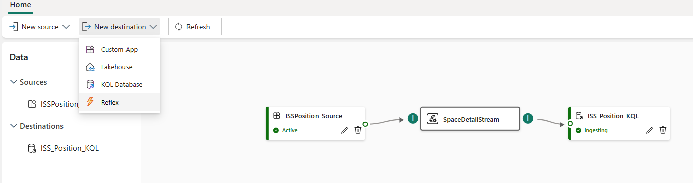
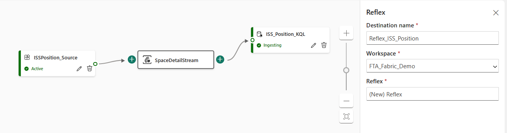
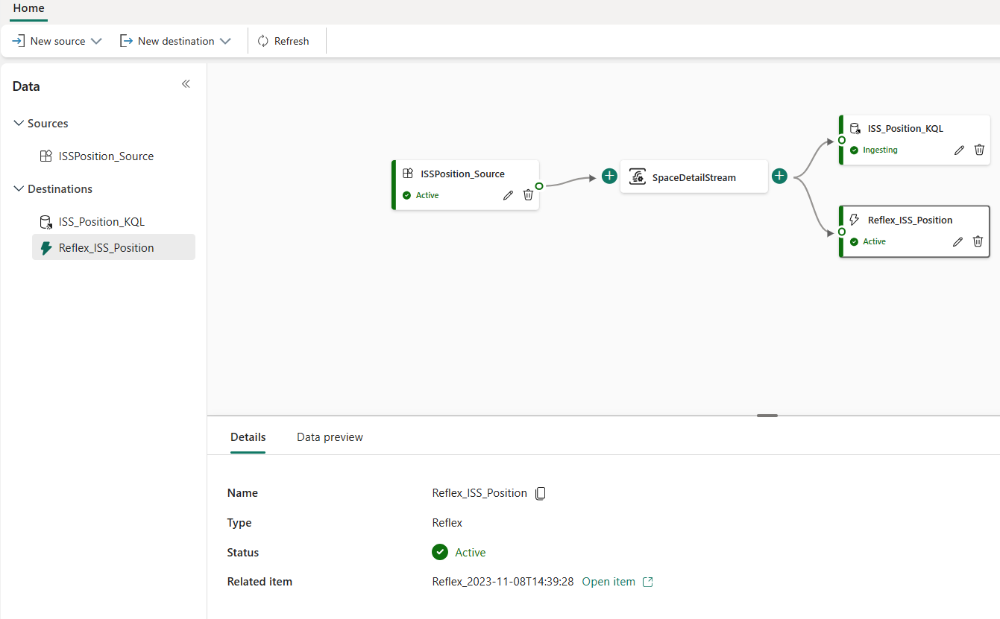
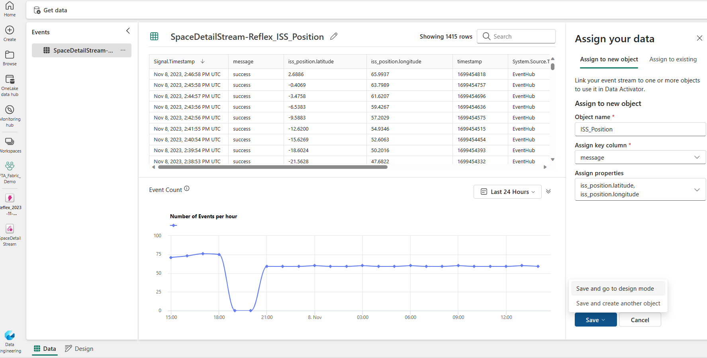
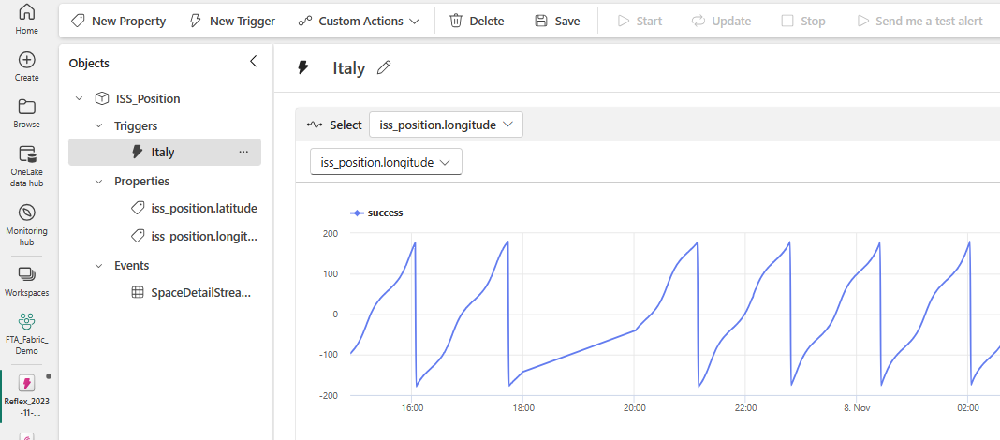
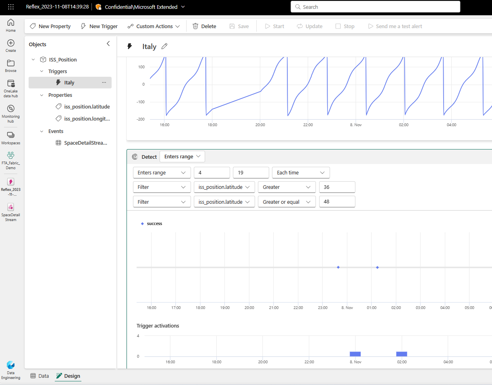
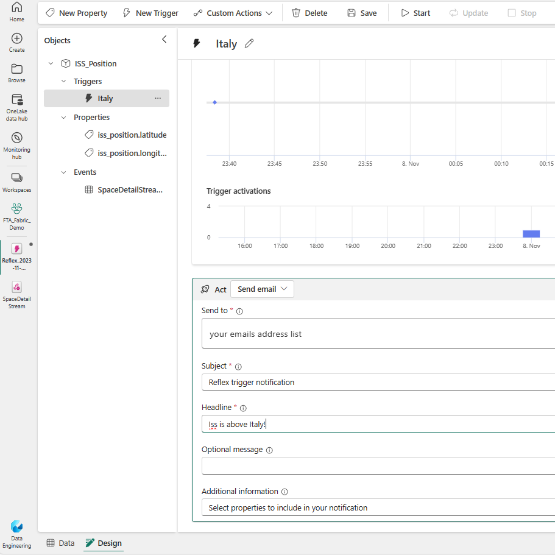

[**Back to the previous step**](/FromZeroToHero_Parma/Real%20Time%20-%20ISS%20-%20How%20to%20proceed/1_ISS_Real_Time_Scenario.md)

# Create a Reflex object

[Data Activator](https://learn.microsoft.com/en-us/fabric/data-activator/data-activator-introduction) is a no-code experience in Microsoft Fabric for automatically taking actions when patterns or conditions are detected in changing data. It monitors data in Power BI reports and Eventstreams items, for when the data hits certain thresholds or matches other patterns. It then automatically takes appropriate action such as alerting users or kicking off Power Automate workflows.

## Create a Reflex item
With the Reflex object you will create a trigger that will notify a list of addresses by email when the ISS is above Italy.

1. Open the EventStream you created with step 1   
   

2. Add a new destination and select **Reflex**   
   

3. Name the destination and the Reflex as per the image below and click **Add**"**   
   

4. Select the new Reflex item and click **Open item**   
   

5. Create a new **Object** and 
   1. call it *ISS_Position*
   2. Using the drop-down list, configure *message* in **Assign key column**
   3. Using the drop-down list, select *latitude* and *longitude* in **Assign properties**   
   4. click **Save and go to design mode**
      

6. From the **Design** tab, create a new **Trigger** and name it *Italy*
   
7. In the **Select** area, using the drop-down list chosse *iss_position.longitude*   
    

8. In the **Detect** area, select *Enter range* and configure it as per the image below   
    

9. In the **Act** area, select *Send email* and configure the recipients and the message you want to send   
    
   
10. Save the configuration by pressing the **Save** button at the top of page

11. Start the trigger by pressing the **Start** button at the top of the page, it will drop an email when ISS position meets the condition specified.

